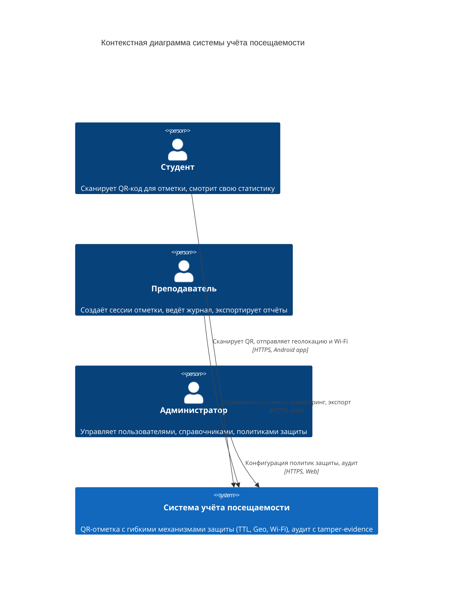
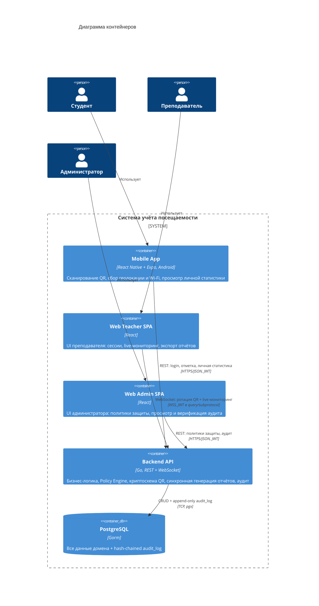

# C4-диаграммы

Системное представление архитектуры через нотацию C4 (Context + Container).
Используется только два верхних уровня — уровни Component и Code раскрываются в отдельных документах по мере реализации.

## Level 1 — System Context

**Внешних систем в MVP нет.** Потенциальные интеграции (ЭИОС, 1С, университетский SSO) выходят за рамки курсовой.

## Level 2 — Container

## Обоснование архитектурных решений

### Монолит, не микросервисы
Для одного разработчика за семестр микросервисы — архитектурное самоубийство: оркестрация, service discovery, distributed tracing, согласованность между сервисами, сетевые ошибки между ними — это инфраструктурный оверхед, который **не демонстрирует ценность темы** (защита от жульничества). В пояснительной записке формулируется как «модульный монолит с чётко выделенными bounded contexts» — звучит так же серьёзно, защищается легче.

### Две SPA, а не одна
`web-teacher` и `web-admin` разделены намеренно:
- **Разные user journeys.** Преподаватель живёт в сессиях и журналах, админ — в настройках и аудите. Объединение в одну SPA увеличило бы когнитивную нагрузку и риск ошибок в role-based доступе.
- **Меньше bundle size у каждой.** Студент и преподаватель не грузят код админской панели.
- **Чёткое разделение зон ответственности** на уровне деплоймента и репозитория.

### WebSocket — только преподаватель
Студент сканирует QR и уходит, ему live-канал не нужен. Преподавателю WebSocket критичен для двух задач: (1) получать свежие ротирующиеся QR-токены от сервера, (2) видеть прилетающие отметки в реальном времени. Админу WebSocket не нужен — аудит и политики меняются редко.

### Монолитный API + WebSocket в одном процессе
Go прекрасно держит тысячи одновременных WebSocket-соединений в одном процессе (`gorilla/websocket` или `nhooyr/websocket`). Выделение gateway оправдано при нагрузке, которой в курсовой нет.

### Нет брокера очередей
RabbitMQ / NATS / Redis не нужен:
- **Отчёты — синхронные** (см. ниже): объёмы в курсовой позволяют.
- **Монолит:** нет второго consumer'а, с которым нужно обмениваться сообщениями.
- **Аудит должен быть синхронным и транзакционным:** очередь здесь наоборот ухудшила бы надёжность (eventual consistency в аудите = уязвимость).
- **WebSocket pub/sub** внутри Go-процесса реализуется через каналы, очередь излишня.

Если на защите спросят «а как будете масштабировать»: ответ — «выделяем тяжёлые операции в отдельные сервисы с брокером, но это за рамками MVP».

### Отчёты — синхронные
Для объёмов курсовой (группа за месяц ≈ сотни строк, поток за семестр ≈ тысячи) `excelize` генерирует файл за секунды. Async-паттерн с таблицей задач + воркером = +300 строк кода, новый контейнер, новая сложность — без реальной выгоды. Эволюционный путь (если потребуется): выделить генератор в отдельный бинарь с Postgres-based очередью через `LISTEN/NOTIFY`.

### JWT, не серверные сессии
- Мобильному клиенту cookie-сессии неудобны (нужен secure storage для куков + CSRF-защита поверх).
- JWT c коротким access-токеном (15 мин) + refresh (7 дней) — стандарт для смешанных web+mobile систем.
- Refresh хранится в httpOnly-cookie для веба и в secure storage (Keychain/Keystore) для мобилки.
- Access передаётся в `Authorization: Bearer`.

### Локальное хранилище файлов, не S3/MinIO
Для MVP Excel/CSV-отчёты отдаются синхронно прямо в HTTP-response, никуда не сохраняются. Если потребуется кэширование — локальный volume, не объектное хранилище.

## Технологический стек (итог)

| Контейнер        | Стек                                          |
|------------------|-----------------------------------------------|
| Mobile App       | React Native + Expo (prebuild), Android-only  |
| Web Teacher SPA  | React, TypeScript                             |
| Web Admin SPA    | React, TypeScript                             |
| Backend API      | Go, REST + WebSocket, Gorm, chi/gin (TBD)     |
| Хранилище        | PostgreSQL                                    |

Выбор HTTP-роутера (chi vs gin vs стандартный net/http) решается на этапе реализации бэкенда.
