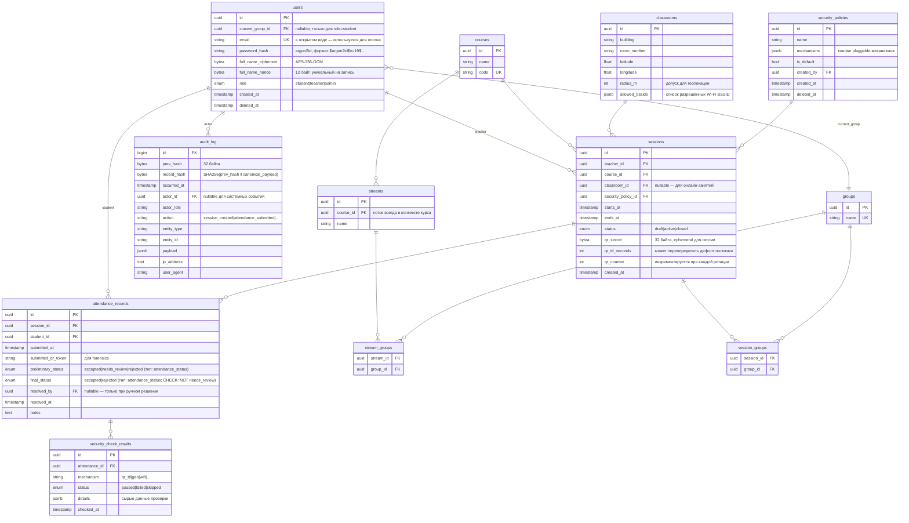

# ER-модель БД

Модель данных системы учёта посещаемости. PostgreSQL, ORM — Gorm.

## Диаграмма



## Сущности — пояснения к неочевидным решениям

### `users`
- Роли жёстко заданы enum'ом (`student`, `teacher`, `admin`) — отдельная таблица ролей и RBAC не требуются: состав ролей стабилен.
- `current_group_id` заполняется только для студентов; для преподавателей и админов — `NULL`. Один студент — в одной группе. История переходов не хранится (не предмет курсовой).
- `password_hash` — **argon2id** (OWASP 2024 recommendation). Self-describing формат хранит соль и параметры внутри строки.
- `full_name_ciphertext` + `full_name_nonce` — **AES-256-GCM**. Nonce 12 байт, уникальный на каждую запись, ключ — из env. GCM-тег включён в ciphertext (authenticated encryption).
- `email` хранится в открытом виде: функциональная необходимость (логин, поиск при приглашении). Защита — TLS в транспорте и ACL на БД.

### `groups`, `streams`, `stream_groups`
- `groups` — **стабильные** единицы (БПИ-21, БПИ-22, ...). Не привязаны к курсу.
- `streams` — **в контексте курса**. «Поток БПИ-21+22 на мат.анализе» и «БПИ-21+22 на философии» — две разные записи, даже при одинаковом составе. Реалистично: потоки формируются курсом.
- `stream_groups` M:N описывает состав потока.

### `classrooms`
- Справочник аудиторий с предустановленными координатами и `allowed_bssids` (массив BSSID в JSONB). Админ управляет реестром — преподаватель при создании сессии просто выбирает аудиторию, не вводит координаты вручную.
- `radius_m` — допуск геолокации; фактическая дистанция от `(latitude, longitude)` сравнивается с этим значением.

### `security_policies`
- `mechanisms` — **JSONB**, а не набор таблиц. Позволяет добавлять новый механизм защиты без миграции БД. Формат:
  ```json
  {
    "qr_ttl":  { "enabled": true, "ttl_seconds": 10 },
    "geo":     { "enabled": true, "radius_override_m": null },
    "wifi":    { "enabled": true, "required_bssids_from_classroom": true },
    "bluetooth_beacon": { "enabled": false }
  }
  ```
- Политика может наследовать параметры от classroom (пример: `required_bssids_from_classroom: true` → брать список BSSID из `classrooms.allowed_bssids`).
- `is_default` — ровно одна запись в таблице должна иметь `true` (enforce уникальным partial-индексом в миграции).

### `sessions`
- `session_groups` (M:N) заменил полиморфную связь `target_type + target_id`. Преподаватель при создании сессии выбирает произвольное множество групп — из одного потока, из разных потоков, или потоки целиком (UI-shortcut: выбор потока = подстановка его групп).
- `qr_secret` (32 байта) + `qr_counter` — основа **stateless-ротации** QR: токен = `{session_id, counter, hmac(qr_secret, session_id ‖ counter)}`. Сервер не хранит таблицу выданных токенов — валидирует подпись и свежесть `counter`.
- `qr_ttl_seconds` — переопределение дефолта политики (если нужно конкретной сессии более строгий режим).

### `attendance_records`
- Оба статусных поля используют один PostgreSQL ENUM тип `attendance_status` (`accepted`, `needs_review`, `rejected`).
- `preliminary_status` — автоматическое решение Policy Engine на момент отметки. Может принять любое из трёх значений.
- `final_status` — ручное решение преподавателя. Ограничен CHECK-констрейнтом: `final_status IN ('accepted', 'rejected')` — значение `needs_review` запрещено, преподаватель обязан принять решение.
- `final_status` + `resolved_by` + `resolved_at` заполняются **только если преподаватель вмешался вручную** (при отсутствии вмешательства считается эквивалентом `preliminary_status`).
- `submitted_qr_token` хранится для forensics (расследование споров).

### `security_check_results`
- По одной записи на каждый применённый к отметке механизм.
- `details` (JSONB) — сырые данные проверки для расследований:
  - для `geo`: `{expected_lat, expected_lng, actual_lat, actual_lng, distance_m, radius_m}`
  - для `wifi`: `{expected_bssids, actual_bssid}`
  - для `qr_ttl`: `{token_issued_at, counter, current_counter}`

### `audit_log`
- **Hash chain** tamper-evidence: `record_hash = SHA256(prev_hash ‖ canonical_json(payload) ‖ timestamp)`. Первая запись — genesis с `prev_hash = bytes32(0)`.
- `id bigint` (а не uuid) — порядок записей критичен для цепочки, integer-id надёжнее как источник порядка.
- Полиморфная привязка к сущности через `entity_type` + `entity_id` — в аудите допустимо (нет необходимости в FK-контроле целостности).
- `canonical_json` — детерминированная сериализация: отсортированные ключи, без пробелов. Иначе верификация сломается на разных рантаймах.

## Инварианты уровня приложения

База данных не гарантирует эти правила — они проверяются в application layer (service-слой Clean Architecture):

1. **Принадлежность групп курсу сессии.** Все `group_id` в `session_groups` должны существовать в `stream_groups` под `streams`, у которых `course_id = sessions.course_id`. Валидация при создании сессии.
2. **Единственная default-политика.** В `security_policies` не более одной записи с `is_default = true`. Enforcement: partial unique index (`CREATE UNIQUE INDEX ... WHERE is_default = true`).
3. **Непрерывность hash-chain.** При вставке записи в `audit_log` берётся `record_hash` последней записи как `prev_hash` новой. Запись в этой таблице идёт через отдельный сервис с сериализацией на уровне транзакций.
4. **`full_name_*` — атомарная пара.** При обновлении `full_name_ciphertext` обязательно обновляется `full_name_nonce` (новый nonce на каждую запись — требование безопасности AES-GCM).
5. **Роль и `current_group_id` согласованы.** Только `role = student` может иметь `current_group_id IS NOT NULL`.

## Что осознанно не моделируется

- **Расписание занятий.** Сессия создаётся ad-hoc преподавателем. Импорт из внешних систем (1С, ЭИОС) — выходит за объём курсовой.
- **Teacher ↔ course/group assignments.** Любой преподаватель может создать сессию на любой курс и группы. Упрощение для MVP.
- **История членства в группах.** Студент переводится — `current_group_id` просто меняется. Журнал переходов не ведётся.
- **Revocation выданных QR-токенов.** Из-за stateless-схемы нет таблицы активных токенов, но и нет возможности отозвать конкретный токен до истечения TTL. TTL коротких (5–15 сек) это компенсирует.
